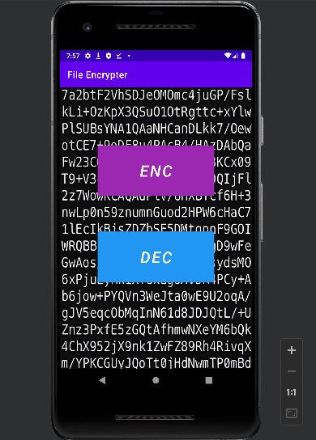
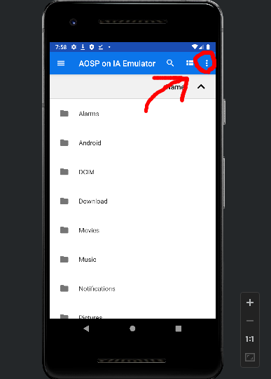
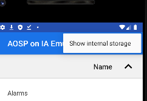
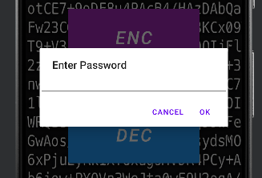

# FileEncrypter-apk
ファイルを暗号化して保存することができます。<br>
apkファイルは`release/FileEncrypter.apk`にあります。<br>
ソースコードも公開しています。<br>


セキュリティの問題
1. アプリを削除したり環境が変わった際にIV(初期化ベクトル)が記憶されていないと  
復元できなくなるのでIVは入力したpasswordを使用している点
2. padding
hashを使用したりして対策しようと思います。  


## Usage
最初の画面はこんな感じ↓<br1>
「ENC」で暗号化を行うファイルを選択し、「DEC」で復号するファイルを選択する。



以下のURIは暗号化できないので注意してください。<br>
```
    content://com.android.providers.media.documents/document/コンテンツID …… システムの画像選択ウィンドウ
    content://com.android.providers.downloads.documents/document/コンテンツID …… ダウンロード
    content://com.google.android.apps.docs.storage/document/コンテンツID …… Google ドライブ
    content://com.dropbox.android.FileCache/filecache/コンテンツID …… Dropbox
```

ファイルを選択する際、`Show internal storage`を有効にしてファイルを選択してください。<br>
    
   

ファイルの選択後、パスワードの入力を求めるダイアログが表示されます。<br>
任意のパスワードを入力してください。<br>
入力されたパスワードでAES暗号方式で暗号化を行います。<br>


    
暗号化後は、`/Android/data/com.example.fileencrypter/`配下に拡張子「.enc」がついて保存されます。<br>
復号する場合も同じく暗号化ファイルを選択し、`/Android/data/com.example.fileencrypter/`配下に保存されます。<br>
※アプリを削除すると、暗号化を行ったファイルも削除されます。
